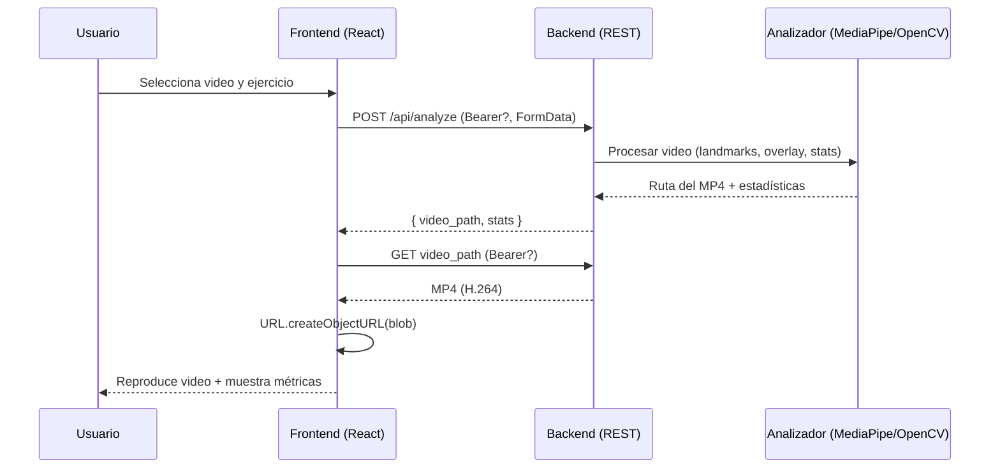
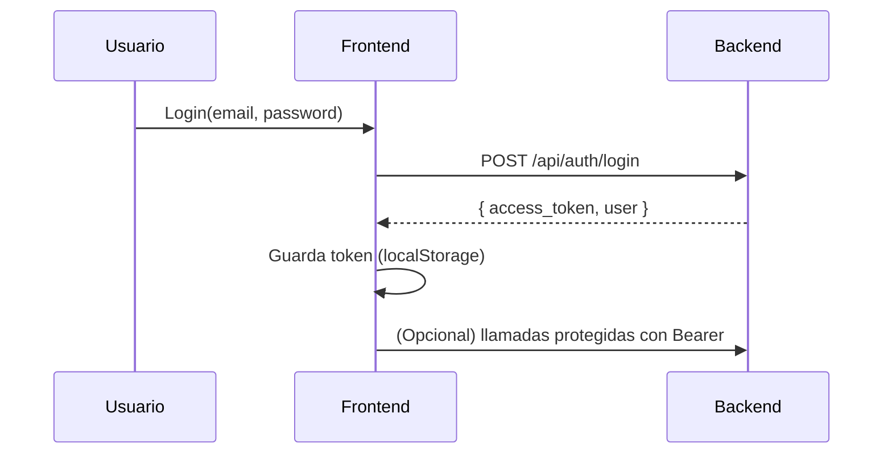
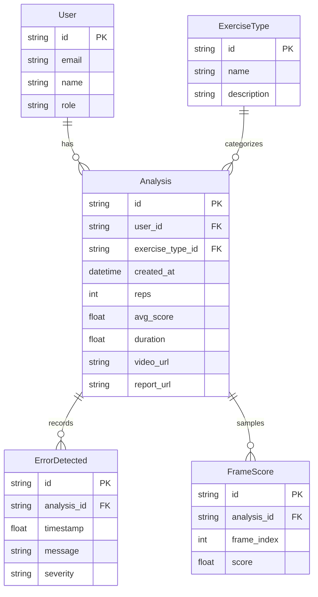

## 3.1 Análisis

- Propósito

  - Permitir a una persona subir un video de un ejercicio, procesarlo con visión por computador (MediaPipe + OpenCV) para evaluar la postura, y visualizar un video con overlays y métricas clave en una SPA.

- Actores

  - Usuario final: sube el video, elige el tipo de ejercicio y visualiza resultados.
  - Servicio de análisis (backend): procesa video, genera overlay con feedback visual y calcula métricas/estadísticas.
  - Entrenador (futuro): recibe/consulta reportes compartidos.

- Alcance

  - Frontend: React + Vite + TypeScript + Tailwind + shadcn/ui.
  - Backend: API REST (Flask u otro framework) que expone endpoints para análisis y autenticación.
  - Persistencia: actualmente no hay DB en el FE; estado manejado con Context. En el BE, opcional (no detallado aquí), se puede persistir análisis y usuarios.

- Requisitos funcionales (principales)

  - Subir video (hasta 100MB aprox) y seleccionar tipo de ejercicio.
  - Invocar análisis y recibir: ruta del video procesado (MP4 con overlay H.264) y estadísticas del análisis.
  - Visualizar resultados: puntaje general, métricas, problemas detectados, línea de tiempo (placeholder), recomendaciones (estáticas por ahora).
  - Flujo de autenticación básico (opcional) para proteger endpoints.

- Requisitos no funcionales

  - Compatibilidad web de video: códec H.264 (avc1) para reproducción en navegadores.
  - Rendimiento: manejo de archivos grandes sin bloquear la UI; soporte a feedback de progreso.
  - Seguridad: CORS entre FE y BE; soporte para Bearer token.
  - Config: URL del backend configurable vía `VITE_API_URL`.
  - Feature flags: `VITE_GPT5_MINI_ENABLED` (por defecto `true`) para habilitar/deshabilitar GPT-5 mini a nivel frontend.

- Entradas/Salidas

  - Input: archivo de video (multipart/form-data) + `exercise_type`.
  - Output: JSON con `video_path` público/temporal y `stats`; el video se descarga aparte como blob MP4.

- Supuestos
  - Los navegadores requieren H.264 para reproducir el MP4; el backend exporta con fourcc compatible.
  - MediaPipe requiere frames RGB; OpenCV convierte desde BGR.

## 3.2 Diseño

### 3.2.1 Arquitectura

- Vista general

  - SPA React (Vite + TS) consume API REST del backend.
  - Comunicación: HTTP (fetch). Para análisis: petición JSON que devuelve ruta del video y estadísticas; luego una segunda petición descarga el MP4.
  - Estado global: `AnalysisContext` almacena el blob del video procesado (o su URL) y las estadísticas para render en `Results`.

- Componentes frontend (carpetas principales)

  - Páginas: `src/pages/VideoUpload.tsx`, `src/pages/Results.tsx`, `src/pages/Index.tsx`, `src/pages/NotFound.tsx`.
  - Contexto: `src/contexts/AnalysisContext.tsx` maneja `analysisData` (blob, stats, tipo de ejercicio) y `resetAnalysis`.
  - Servicios: `src/services/api.ts`
    - `VideoAnalysisAPI.uploadAndAnalyze(file, exerciseType)`: POST `/api/analyze` → JSON con `video_path` + `stats`; luego GET al `video_path` → Blob MP4.
    - `getExerciseTypes()`: GET `/api/exercise-types`.
    - `healthCheck()`: GET `/api/health`.
    - `AuthAPI`: `register`, `login`, `forgotPassword`, `resetPassword`, `getCurrentUser`, `logout`, `isAuthenticated`.
  - UI: componentes shadcn en `src/components/ui/*` y estilos con Tailwind.

- Componentes backend (esperados)

  - Endpoints:
    - POST `/api/analyze`: recibe el video y tipo de ejercicio; procesa y responde JSON `{ video_path, stats }`.
    - GET `<video_path>`: devuelve el MP4 procesado (H.264) para descarga/streaming.
    - GET `/api/exercise-types`: catálogo de ejercicios.
    - GET `/api/health`: estado.
    - Auth: `/api/auth/register`, `/api/auth/login`, `/api/auth/me`, `/api/auth/forgot-password`, `/api/auth/reset-password`.
  - Analizador: MediaPipe Pose + OpenCV, cálculo de ángulos, scoring y overlay.

- Flujo de datos

  - FE: File → FormData → POST `/api/analyze` → JSON `{ video_path, stats }` → GET `video_path` → Blob MP4 → `URL.createObjectURL(blob)` → `<video src>`.

- Observaciones
  - Separación FE/BE permite escalar análisis (colas, workers) sin tocar UI.
  - Con `video_path` se evita transferir blobs binarios en la respuesta JSON del análisis.

### 3.2.2 Casos de uso

- UC1: Subir y analizar video

  - Actor: Usuario (autenticado opcionalmente)
  - Flujo básico:
    1. Usuario selecciona archivo y tipo de ejercicio.
    2. FE envía `POST /api/analyze` (multipart o JSON + upload según implementación del BE).
    3. BE procesa y devuelve `{ video_path, stats }`.
    4. FE descarga el MP4 de `video_path` y lo renderiza junto a `stats`.
  - Alternos/errores: archivo inválido, error de códec, tiempo de espera; FE muestra mensaje y permite reintento.

- UC2: Consultar tipos de ejercicio

  - Actor: Usuario
  - Flujo: FE consulta `GET /api/exercise-types`; si falla, usa fallback local.

- UC3: Ver resultados del análisis

  - Actor: Usuario
  - Flujo: FE crea URL del Blob (`URL.createObjectURL`) y lo asigna al `<video>`; limpia con `URL.revokeObjectURL` al desmontar.

- UC4: Descargar reporte (pendiente)

  - Flujo deseado: generar PDF con métricas y capturas; hoy botón placeholder.

- UC5: Compartir con entrenador (pendiente)

  - Flujo deseado: generar link compartible o envío por email/WhatsApp.

- UC6: Health Check (interno)

  - Actor: FE o DevOps; consulta `/api/health` para monitoreo.

- UC7: Autenticación (opcional)
  - Registro, login, recuperación y restablecimiento de contraseña; uso de token Bearer en endpoints protegidos.

### 3.2.3 Diagramas de secuencia

Secuencia principal: análisis de video con token opcional.



Secuencia: autenticación (resumen):



### 3.2.4 Diagrama entidad-relación (conceptual)

> La versión actual puede no persistir; este ER propone una futura persistencia.



### 3.2.5 Algoritmos

- Backend (núcleo)

  - Detección de pose: MediaPipe Pose (`model_complexity=2`, `smooth_landmarks=true`).
  - Cálculo de ángulos: producto punto `calcular_angulo(a,b,c)`; rodilla (cadera–rodilla–tobillo), espalda (hombro–cadera–vertical).
  - Scoring por ejercicio:
    - Sentadilla: umbrales de ángulo de rodilla (bajar/subir), postura de espalda y alineación de rodillas con penalizaciones.
    - Peso muerto: postura de espalda (ángulo respecto a vertical).
    - Press banca: ángulo de codo (profundidad y simetría básica).
  - Conteo de repeticiones: máquina de estados simple (preparando → bajando → preparando) en función de umbrales.
  - Overlay: panel (score, reps, tiempo, estado), feedback textual multi-línea, landmarks dibujados.
  - Video: exportación con `cv2.VideoWriter` y códec H.264 (compatibilidad navegadores).
  - Resumen final: frame sintético (3s) con agregados (reps, score promedio, principales errores).

- Frontend
  - Recepción de JSON (`{ video_path, stats }`) y descarga del MP4.
  - Reproducción: `URL.createObjectURL(blob)` → `<video src>`; cleanup con `URL.revokeObjectURL`.
  - Derivación de UI: score general, duración, conteo de frames, issues con severidad, métricas corporales (sintéticas si no hay stats por parte del BE).
  - Edge cases: FPS=0 (duración 0), sin landmarks (mensaje overlay), archivos grandes (feedback de progreso con `onProgress`).

### 3.2.6 Interfaces

- Configuración

  - `VITE_API_URL`: base URL del backend (por ejemplo, `https://api.midominio.com`). Si no está definida, se usa `http://localhost:5000`.
  - `VITE_GPT5_MINI_ENABLED`: activa/desactiva características relacionadas a GPT-5 mini (por defecto `true`).

- API (contratos actuales esperados por el FE)

  - POST `/api/analyze`
    - Auth: opcional Bearer en `Authorization`.
    - Request: `multipart/form-data`
      - `video`: File
      - `exercise_type`: `'sentadilla' | 'peso_muerto' | 'press_banca'`
    - Response (200):
      ```json
      {
        "video_path": "/media/analyzed/analyzed_sentadilla_abc123.mp4",
        "stats": {
          "repeticiones": 7,
          "errores_detectados": [
            { "timestamp": 12.5, "error": "Rodillas hacia adentro" }
          ],
          "scores_por_frame": [85, 87, 90],
          "duracion_segundos": 45.0,
          "score_promedio": 82.3
        }
      }
      ```
  - GET `<video_path>`
    - Response: `video/mp4` (H.264). Sirve archivo para descarga o streaming.
  - GET `/api/exercise-types`
    - Response: `{ id, name, description }[]` (o `{ exercise_types, descriptions }` según implementación).
  - GET `/api/health`
    - Response: `{ status: 'OK', message: string }`.
  - Auth
    - POST `/api/auth/register` → `{ access_token, user }`
    - POST `/api/auth/login` → `{ access_token, user }`
    - GET `/api/auth/me` → `user`
    - POST `/api/auth/forgot-password` → `{ message }`
    - POST `/api/auth/reset-password` → `{ message }`

- Tipos en frontend (TypeScript)
  - `AnalysisResult` (en `services/api.ts`):
    ```ts
    export interface AnalysisResult {
      repeticiones: number;
      errores_detectados: Array<{ timestamp: number; error: string }>;
      scores_por_frame: number[];
      duracion_segundos: number;
      score_promedio: number;
    }
    ```
  - `ExerciseType`:
    ```ts
    export interface ExerciseType {
      id: string;
      name: string;
      description: string;
    }
    ```
  - Auth:
    ```ts
    export interface AuthResponse {
      access_token: string;
      user: { id: string; email: string; name?: string };
    }
    ```

## Notas y siguientes pasos

- Integrar por completo estadísticas reales del backend en `Results.tsx` eliminando placeholders.
- Implementar feedback de progreso: usar `XMLHttpRequest`/`axios` para escuchar `upload.onprogress` y exponerlo vía `onProgress`.
- Agregar persistencia: un servicio/DB para almacenar análisis y permitir compartir/consultar históricos (ver ER).
- Reporte PDF: generación en backend (ReportLab/WeasyPrint) o en FE (react-pdf) con capturas y métricas.
- Monitoreo: logs de tiempos por análisis y métricas de uso; health check en CI/CD.
